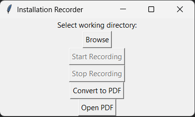

# ScreenScribe
ScreenScribe is an easy to use screen recording and annotation tool that captures installation steps, user interactions, and generates detailed documentation automatically. It's perfect for creating software installation guides, user manuals, and technical documentation.
## Features
### Screen Capture
 Captures high-resolution screenshots (up to 4K @ 600 DPI)
 Automatically focuses on active windows only
 Records mouse clicks with visual indicators
 Maintains image quality throughout the documentation
### Interaction Tracking
 Records all keyboard inputs and shortcuts
 Captures clipboard content (copy/paste operations)
 Tracks special key combinations (Ctrl+A, Ctrl+C, etc.)
 Documents mouse clicks with surrounding context
### Text Recognition
 OCR functionality around clicked areas
 Captures text from user interfaces
 Intelligent text extraction from screenshots
 Multi-language text support
### Documentation Generation
 Automatically generates markdown documentation
 Creates timestamped folders for each recording session
 Converts documentation to high-quality PDFs
 Includes annotated screenshots with click indicators
### User Interface
 Simple and intuitive GUI
 Start/Stop recording controls
 PDF conversion with progress indication
 Quick access to generated documentation

## How to use:
### Windows Instructions:
1. Install Conda Environment: `conda create --name ScreenScribe python=3.12`
. Activate Conda Environment: `conda activate ScreenScribe`
. Install requirements.txt: `pip install -r requirements.txt`
. Install wkhtmltopdf on Windows: `https://wkhtmltopdf.org/downloads.html`
. Install Tesseract OCR on Windows: `https://github.com/UB-Mannheim/tesseract/wiki`
. Add Tesseract OCR to PATH: `set PATH=%PATH%;"C:\Program Files\Tesseract-OCR"`    
. Add wkhtmltopdf to PATH: `set PATH=%PATH%;"C:\Program Files\wkhtmltopdf\bin"`
. Run the script: `python main.py`

## Output Format
 Timestamped folders for each recording session
 High-quality PNG screenshots
 Detailed markdown documentation
 Professional PDF conversion
 Organized file structure
## Known Issues:
. If using second monitor, the apps on the second monitor will not be captured and shows a blank screen.
. The keystrokes are not recorded correctly. 
. The text around the clicked region is not captured correctly. 
## Future Improvements:
. Add support for other operating systems
. Enhance multi-monitor support
. Improve text recognition accuracy
. Add video recording capabilities
. Implement cloud storage integration
. Add custom annotation tools

# How to use:

### Windows Instructions:

1. Install Conda Envirement: `conda create --name ScreenScribe python=3.12`
2. Activate Conda Envirement: `conda activate ScreenScribe`
3. Install requirements.txt: `pip install -r requirements.txt`
4. Install wkhtmltopdf on Windows: `https://wkhtmltopdf.org/downloads.html`
5. Install Tesseract OCR on Windows: `https://github.com/UB-Mannheim/tesseract/wiki`
6. Add Tesseract OCR to PATH: `set PATH=%PATH%;"C:\Program Files\Tesseract-OCR"`    
7. Add wkhtmltopdf to PATH: `set PATH=%PATH%;"C:\Program Files\wkhtmltopdf\bin"`
8. Run the script: `python main.py`

# Screenshot:

# Example Output PDF:

## Contributing
Contributions are welcome! Please feel free to submit pull requests.

